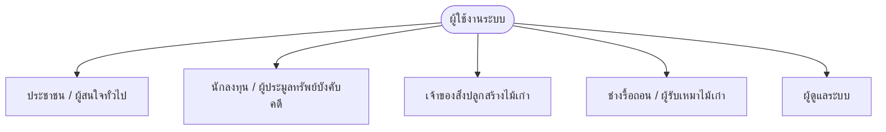

# 📋 ข้อกำหนดความต้องการของระบบ (Software Requirements Specification: SRS)

**โครงการ:** เว็บไซต์และแอปพลิเคชันตลาดอสังหาริมทรัพย์ ทรัพย์บังคับคดี และสิ่งปลูกสร้างไม้เก่า จังหวัดกาฬสินธุ์  
**เวอร์ชันเอกสาร:** 2.0 (Docker Multi-Container Edition)  
**สถาปัตยกรรม:** 
- **Frontend:** React 19, Vite, Tailwind CSS (Nginx Reverse Proxy)
- **Backend:** Node.js, Express.js, TypeScript
- **Database:** PostgreSQL 16 (ผ่าน Prisma ORM)
- **Containerization:** Docker & Docker Compose ทั้งโปรเจกต์
- **แหล่งข้อมูลอ้างอิง:** ฐานข้อมูลจริง 100% จาก FastLEDChecker (https://www.fastledchecker.com) และกรมบังคับคดี (LED)

---

## 1. วัตถุประสงค์และขอบเขตของระบบ (Purpose & Scope)

ระบบนี้ถูกพัฒนาขึ้นเพื่อแก้ไขปัญหา **ความไม่สมมาตรของสารสนเทศ (Information Asymmetry)** และความเสี่ยงในการลงทุนทรัพย์บังคับคดี โดยเป็นศูนย์กลางเชื่อมโยงข้อมูลทรัพย์สินของกรมบังคับคดีในจังหวัดกาฬสินธุ์ทั้ง 18 อำเภอ 133 ตำบล ร่วมกับเครื่องมือคำนวณราคาประมูลสูงสุด (Max Bid) และการประเมินราคาตามจริงจากฐานข้อมูล FastLEDChecker.com

นอกจากนี้ ยังรองรับตลาดการซื้อขายสิ่งปลูกสร้างไม้เก่าจริงที่ลงประกาศโดยประชาชน และเครือข่ายช่างรื้อถอนผู้เชี่ยวชาญในท้องถิ่น

---

## 2. กลุ่มผู้ใช้งานระบบ (User Personas & Role Matrix)

1. **ประชาชนทั่วไป (Public):** ค้นหาทรัพย์สินตามเขตพื้นที่ ค้นหาข้อมูลช่างรื้อถอน
2. **นักลงทุน (Investor):** วิเคราะห์เพดานราคาประมูล Max Bid, ตรวจสอบภาระจำนองติดไป, เปิดดูข้อมูลทรัพย์ต้นทางบน FastLEDChecker.com
3. **เจ้าของสิ่งปลูกสร้างไม้เก่า (Wood Owner):** นำเข้าข้อมูลบ้านไม้เก่าของตนเอง ประเมินราคาด้วย AI Wood Engine และลงประกาศจริง
4. **ช่างรื้อถอน (Contractor):** นำเสนอประวัติ ประสบการณ์ และเบอร์โทรติดต่อสำหรับรับงานรื้อถอน/ขนย้าย
5. **ผู้ดูแลระบบ (Admin):** ตรวจสอบและบริหารจัดการฐานข้อมูลผ่าน Prisma และ Docker Container

---

## 3. ข้อกำหนดเชิงหน้าที่ (Functional Requirements: FR)

### FR-01: ระบบค้นหาและคัดกรองอัจฉริยะ (Smart Search & Dynamic Filter)
* **FR-01.1:** รองรับ Full-text Search ค้นหาชื่อทรัพย์, อำเภอ, ตำบล, เลขที่โฉนด, และหมายเลขคดีแดง
* **FR-01.2:** ตัวกรองอำเภอครอบคลุม **18 อำเภอ** ในจังหวัดกาฬสินธุ์
* **FR-01.3:** ระบบอัปเดตตัวกรอง **ตำบล (Sub-district)** 133 ตำบล สัมพันธ์กับอำเภอที่เลือกโดยอัตโนมัติ
* **FR-01.4:** ตัวกรองประเภททรัพย์:
  - ทรัพย์บังคับคดี (`led_asset`)
  - ที่ดินพร้อมสิ่งปลูกสร้าง (`has_structure`)
  - สิ่งปลูกสร้างไม้เก่าที่ลงประกาศ (`wooden_building`)
* **FR-01.5:** ตัวกรองช่วงราคาเริ่มต้นประมูล (ต่ำกว่า 5 แสน, 5 แสน - 1 ล้าน, 1 - 2 ล้าน, มากกว่า 2 ล้าน)

### FR-02: การเชื่อมโยงข้อมูลจริงและการเปิดดูบน FastLEDChecker.com
* **FR-02.1 (Authentic Real Data Only):** ข้อมูลทรัพย์สินตั้งต้นในระบบต้องเป็นข้อมูลจริง 100% จำนวน **900 รายการ** ที่อ้างอิงจากฐานข้อมูล `https://www.fastledchecker.com` และกรมบังคับคดี (LED)
* **FR-02.2 (Mock Wood Removal):** ปราศจากข้อมูลสิ่งปลูกสร้างไม้เก่าจำลอง (Mock items) 100%
* **FR-02.3 (Direct External Link on Modal):** หน้าต่างรายละเอียดทรัพย์ต้องมีปุ่ม **"🌐 เปิดดูบน FastLEDChecker.com"** เพื่อเปิดดูหน้าประกาศต้นทาง `https://www.fastledchecker.com/asset/{id}` ในแท็บใหม่
* **FR-02.4 (Quick Link on Card):** มีปุ่มทางลัด FastLEDChecker บนการ์ดทรัพย์สินทุกรายการ

### FR-03: เครื่องมือวิเคราะห์ FastLEDChecker Analytics Engine
* **FR-03.1 (Maximum Bid Calculator):** คำนวณราคาเคาะสูงสุดที่ยังได้กำไรตามเป้าหมาย (หักลบหนี้จำนองติดไป, ค่าฟ้องขับไล่, ค่าปรับปรุง, ค่าโอน 3.5%)
* **FR-03.2 (Mortgage Debt Inspector):** แสดงยอดหนี้จำนองติดไปอย่างชัดเจน และคำนวณ `ราคาจริงที่ต้องจ่าย = ราคาเคาะ + ยอดจำนองติดไป`
* **FR-03.3 (Implicit Cost Estimator):** ประเมินต้นทุนแฝง (ภาษีโอน 2%, ภาษีหัก ณ ที่จ่าย 1%, อากร 0.5%, ค่าขับไล่)

### FR-04: ตลาดสิ่งปลูกสร้างไม้เก่าจริง & Wood Valuation Engine
* **FR-04.1:** คำนวณมูลค่าเนื้อไม้จริงตามชนิดไม้ (สัก, ประดู่, แดง, เต็ง), ปริมาตร (ลบ.ม.), เสาเรือนโบราณ, และสภาพไม้ (%)
* **FR-04.2:** แบบฟอร์มลงประกาศขายบ้านไม้เก่าจริงสำหรับประชาชน พร้อมคำนวณราคาแนะนำอัตโนมัติ และบันทึกลงฐานข้อมูล PostgreSQL ผ่าน API

### FR-05: แผนที่สารสนเทศภูมิศาสตร์ (GIS Interactive Map)
* **FR-05.1:** แสดงหมุดทรัพย์สินบนแผนที่ Leaflet.js พิกัดจังหวัดกาฬสินธุ์
* **FR-05.2:** แยกสีหมุดตามประเภททรัพย์สิน และคลิกหมุดเพื่อเปิดดูข้อมูลเชิงลึกได้ทันที

### FR-06: ระบบเปรียบเทียบทรัพย์สิน (Side-by-Side Comparison)
* **FR-06.1:** เลือกเปรียบเทียบทรัพย์สินได้สูงสุด 3 รายการพร้อมกัน
* **FR-06.2:** แสดงตารางเปรียบเทียบราคาเคาะ, หนี้จำนอง, เพดาน Max Bid, และข้อมูลที่ตั้ง

---

## 4. ข้อกำหนดที่มิใช่เชิงหน้าที่ (Non-Functional Requirements: NFR)

1. **สถาปัตยกรรมคอนเทนเนอร์ (Containerization & Portability):**
   - รันทั้งระบบผ่าน Docker Compose ประกอบด้วย 3 คอนเทนเนอร์แยกส่วนอิสระ (Frontend Nginx, Backend Express, PostgreSQL)
2. **ประสิทธิภาพและความเร็ว (Performance):**
   - การตอบสนองของ REST API จาก Express และ PostgreSQL ต้องต่ำกว่า 150 มิลลิวินาที
   - การเรนเดอร์ Client-side ด้วย Vite และ Tailwind CSS ต้องแสดงผลทันทีแบบ Instant Rendering
3. **ความถูกต้องสมบูรณ์ของข้อมูล (Data Integrity):**
   - ฐานข้อมูล PostgreSQL มีการกำหนด Constraints และ Type Safety ผ่าน Prisma Client ป้องกันความผิดพลาดของข้อมูล
4. **ความพร้อมใช้งานและการขยายตัว (Availability & Scalability):**
   - มี Nginx Reverse Proxy คอยส่งผ่านคำขอ `/api` ไปยัง Backend และมี Healthcheck ตรวจสอบความพร้อมของฐานข้อมูลตลอดเวลา
