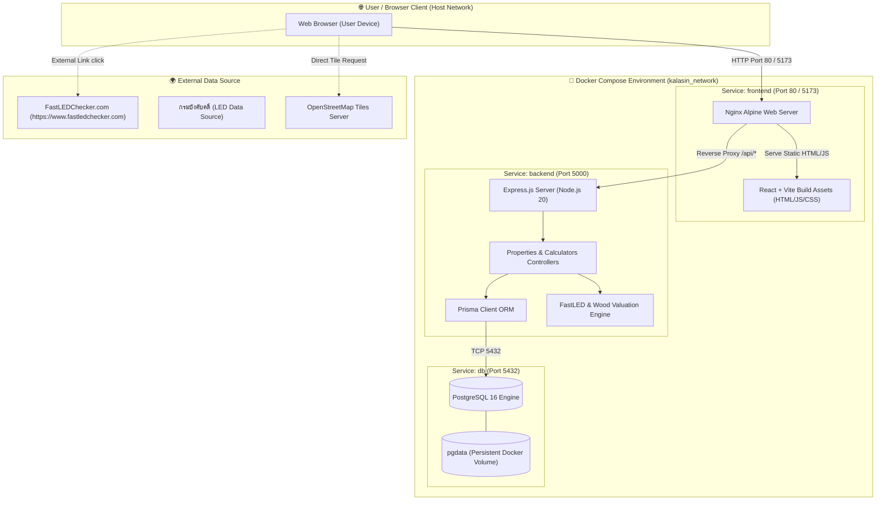
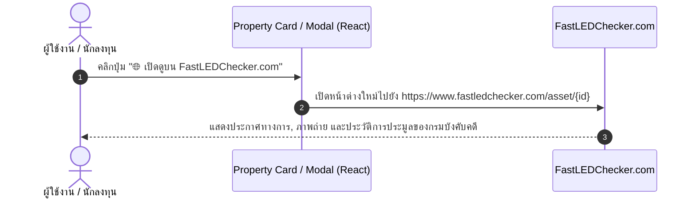
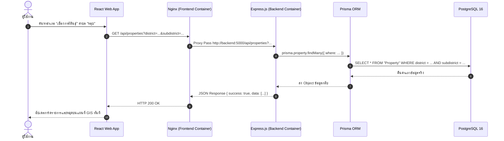

# 🏗️ สถาปัตยกรรมระบบ (System Architecture)

**โครงการ:** เว็บไซต์และแอปพลิเคชันตลาดอสังหาริมทรัพย์ ทรัพย์บังคับคดี และสิ่งปลูกสร้างไม้เก่า จังหวัดกาฬสินธุ์  
**รูปแบบสถาปัตยกรรม:** Decoupled Client-Server Multi-Container Architecture (Docker Compose)  
**เทคโนโลยีหลัก:**
- **Frontend Container (`kalasin_frontend`):** React 19, Vite, Tailwind CSS, Leaflet GIS, Nginx Alpine Reverse Proxy
- **Backend Container (`kalasin_backend`):** Node.js 20, Express.js, TypeScript, Prisma Client 6
- **Database Container (`kalasin_postgres`):** PostgreSQL 16 Alpine พร้อม Persistent Volume

---

## 1. ภาพรวมสถาปัตยกรรมเชิงคอนเทนเนอร์ (Containerized Architecture Context)

ระบบทำงานบน **Docker Compose Network** โดยแบ่งความรับผิดชอบออกเป็น 3 บริการหลักที่แยกส่วนกันอย่างชัดเจน (Separation of Concerns):

---

## 2. การแบ่งเลเยอร์ซอฟต์แวร์ (Detailed Layer Breakdown)

### 2.1 Frontend Layer (`client/`)
* **Core:** React 19 + Vite สำหรับการพัฒนาที่รวดเร็ว (Hot Module Replacement) และ Production Bundling ที่มีประสิทธิภาพ
* **Style:** Tailwind CSS สำหรับการออกแบบ User Interface แบบ Responsive รองรับหน้าจอคอมพิวเตอร์ แท็บเล็ต และสมาร์ตโฟน
* **Web Server:** Nginx Alpine ทำหน้าที่:
  1. เสิร์ฟ Static Files (HTML, JS, CSS, Assets)
  2. ทำหน้าที่เป็น **Reverse Proxy** ส่งคำขอที่มีเส้นทางขึ้นต้นด้วย `/api/` ไปยังคอนเทนเนอร์ `backend:5000` โดยอัตโนมัติ ช่วยป้องกันปัญหา Cross-Origin Resource Sharing (CORS) ในระดับเครือข่าย

### 2.2 Backend Layer (`server/`)
* **Core:** Express.js บน Node.js 20 Alpine พัฒนาด้วย TypeScript เพื่อความถูกต้องของ Type Safety
* **สถาปัตยกรรมภายใน:**
  - `src/controllers/propertiesController.ts`: จัดการคำสั่งสืบค้น, คัดกรอง 18 อำเภอ 133 ตำบล, และรับลงประกาศ
  - `src/controllers/calculatorsController.ts`: ประมวลผลคำนวณราคาประมูล Max Bid และราคาประเมินเนื้อไม้
  - `src/lib/fastled_engine.ts`: อัลกอริทึมสูตรคำนวณทางการเงินและการประเมินไม้เก่า
  - `src/lib/prisma.ts`: การจัดการ Database Connection Pool ของ Prisma Client

### 2.3 Database Layer (`db`)
* **DBMS:** PostgreSQL 16 Alpine
* **ORM:** Prisma ORM v6 สำหรับ Migration, Type-Safe Data Querying, และ Seed Data
* **Data Volume:** ทำการ Mount Volume `pgdata` ไว้นอกคอนเทนเนอร์ ทำให้ข้อมูลคงอยู่ถาวรแม้จะ Restart หรือ Rebuild คอนเทนเนอร์

---

## 3. ผังการทำงานเมื่อผู้ใช้กดเปิดดูบน FastLEDChecker.com

---

## 4. ผังการส่งคำขอข้อมูลระหว่าง Frontend, Backend และ PostgreSQL

