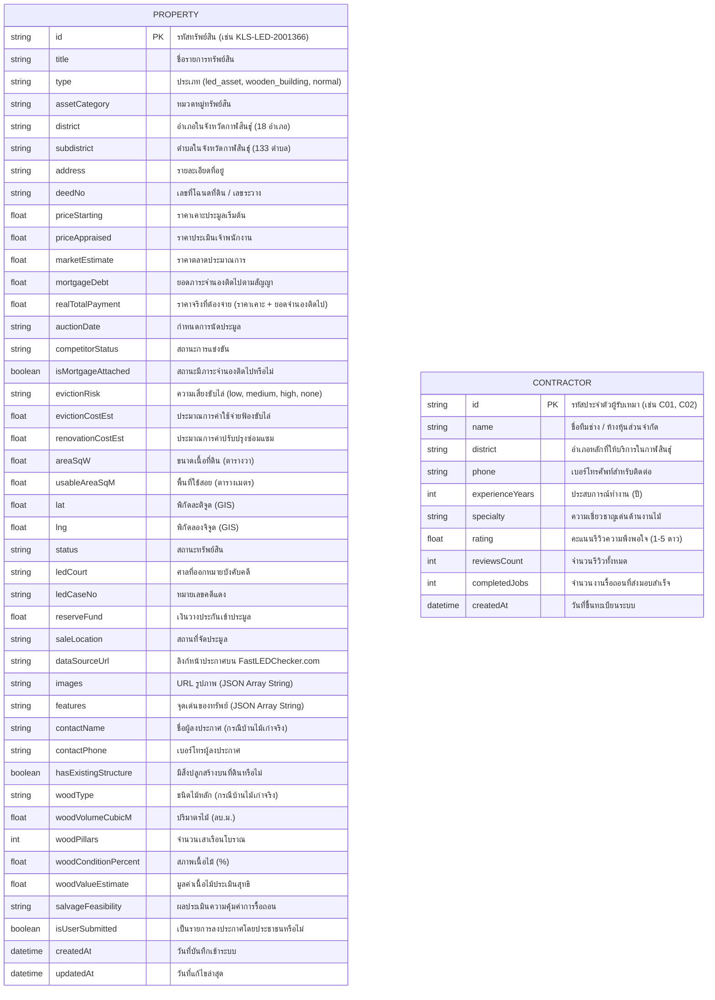

# 🗄️ การออกแบบฐานข้อมูล (Database Schema & Data Model)

**โครงการ:** เว็บไซต์และแอปพลิเคชันตลาดอสังหาริมทรัพย์ ทรัพย์บังคับคดี และสิ่งปลูกสร้างไม้เก่า จังหวัดกาฬสินธุ์  
**ระบบจัดการฐานข้อมูล (DBMS):** PostgreSQL 16 (รันบน Docker Container `kalasin_postgres`)  
**เครื่องมือจัดการฐานข้อมูล (ORM):** Prisma ORM (v6.4.1)  
**แหล่งข้อมูลและคุณภาพ:** ข้อมูลจริง 100% จำนวน **900 รายการ** จาก `FastLEDChecker.com` ครอบคลุม 18 อำเภอ 133 ตำบล (ตัดข้อมูล Mockup ไม้เก่าออกทั้งหมด)

---

## 1. แผนภาพความสัมพันธ์เชิงข้อมูล (Entity Relationship Diagram: ERD)



---

## 2. พจนานุกรมข้อมูล (Data Dictionary)

### 2.1 ตาราง `Property` (ตารางหลักสำหรับทรัพย์บังคับคดีและบ้านไม้เก่า)

| ชื่อฟิลด์ | ชนิดข้อมูล | เงื่อนไข | คำอธิบาย | ข้อมูลตัวอย่าง |
| :--- | :--- | :--- | :--- | :--- |
| `id` | String | Primary Key | รหัสเฉพาะของทรัพย์สิน | `"KLS-LED-2001366"` |
| `title` | String | Not Null | ชื่อประกาศทรัพย์สิน | `"ที่ดินพร้อมสิ่งปลูกสร้าง ต.หนองอีบุตร"` |
| `type` | String | Not Null | ประเภททรัพย์ (`led_asset`, `wooden_building`) | `"led_asset"` |
| `assetCategory`| String | Not Null | หมวดหมู่ทรัพย์ | `"ที่ดินพร้อมสิ่งปลูกสร้าง"` |
| `district` | String | Not Null | อำเภอ (18 อำเภอกาฬสินธุ์) | `"ห้วยผึ้ง"` |
| `subdistrict` | String | Not Null | ตำบล (133 ตำบลกาฬสินธุ์) | `"หนองอีบุตร"` |
| `address` | String | Not Null | ที่ตั้งทางกายภาพ | `"ต.หนองอีบุตร อ.ห้วยผึ้ง จ.กาฬสินธุ์"` |
| `deedNo` | String | Not Null | เลขที่โฉนดที่ดิน | `"โฉนด 4020"` |
| `priceStarting`| Float | Not Null | ราคาเริ่มต้นเคาะประมูล | `185000.0` |
| `priceAppraised`| Float | Not Null | ราคาประเมินเจ้าพนักงาน | `220000.0` |
| `marketEstimate`| Float | Not Null | ราคาตลาดประเมิน | `260000.0` |
| `mortgageDebt` | Float | Default: 0 | ยอดภาระหนี้จำนองติดไป | `0.0` |
| `realTotalPayment`| Float | Not Null | ยอดจ่ายจริง (`priceStarting + mortgageDebt`)| `185000.0` |
| `isMortgageAttached`| Boolean | Default: false | มีภาระจำนองติดไปหรือไม่ | `false` |
| `evictionRisk` | String | Default: "low" | ระดับความเสี่ยงการฟ้องขับไล่ | `"low"` |
| `lat` | Float | Not Null | พิกัดละติจูด (GIS) | `16.5910` |
| `lng` | Float | Not Null | พิกัดลองจิจูด (GIS) | `103.9050` |
| `ledCaseNo` | String | Nullable | หมายเลขคดีแดงของกรมบังคับคดี | `"ผบE.1218/2568"` |
| `dataSourceUrl`| String | Nullable | **ลิงก์หน้าประกาศบน FastLEDChecker.com** | `"https://www.fastledchecker.com/asset/2001366"` |
| `images` | String | Not Null | ภาพถ่ายทรัพย์สิน (JSON Array String) | `["https://..."]` |
| `isUserSubmitted`| Boolean| Default: false| รายการลงประกาศโดยประชาชนหรือไม่ | `false` |

---

### 2.2 ตาราง `Contractor` (สารบบทีมช่างรื้อถอนและบริการไม้เก่า)

| ชื่อฟิลด์ | ชนิดข้อมูล | เงื่อนไข | คำอธิบาย | ข้อมูลตัวอย่าง |
| :--- | :--- | :--- | :--- | :--- |
| `id` | String | Primary Key | รหัสช่าง | `"C01"` |
| `name` | String | Not Null | ชื่อทีมช่าง / ผู้รับเหมา | `"หจก. กาฬสินธุ์ไม้เก่ารื้อถอน"` |
| `district` | String | Not Null | อำเภอหลักที่ให้บริการ | `"เมืองกาฬสินธุ์"` |
| `phone` | String | Not Null | เบอร์โทรศัพท์ติดต่อ | `"081-876-5432"` |
| `experienceYears`| Int | Not Null | ประสบการณ์ (ปี) | `15` |
| `specialty` | String | Not Null | ความเชี่ยวชาญเฉพาะ | `"รื้อถอนเรือนไม้โบราณ คัดแยกไม้ ขนย้าย"` |
| `rating` | Float | Default: 4.5 | คะแนนรีวิว (1-5 ดาว) | `4.8` |
| `reviewsCount` | Int | Default: 0 | จำนวนรีวิว | `32` |
| `completedJobs` | Int | Default: 0 | งานที่ส่งมอบแล้ว | `140` |

---

## 3. ไฟล์นิยามโมเดล PostgreSQL (`server/prisma/schema.prisma`)

```prisma
generator client {
  provider = "prisma-client-js"
}

datasource db {
  provider = "postgresql"
  url      = env("DATABASE_URL")
}

model Property {
  id                   String   @id
  title                String
  type                 String   // "led_asset", "wooden_building", "normal"
  assetCategory        String
  district             String
  subdistrict          String
  address              String
  deedNo               String
  priceStarting        Float
  priceAppraised       Float
  marketEstimate       Float
  mortgageDebt         Float    @default(0)
  realTotalPayment     Float
  auctionDate          String?
  competitorStatus     String?
  isMortgageAttached   Boolean  @default(false)
  evictionRisk         String   @default("low")
  evictionCostEst      Float    @default(0)
  renovationCostEst    Float    @default(0)
  areaSqW              Float    @default(0)
  usableAreaSqM        Float    @default(0)
  lat                  Float
  lng                  Float
  status               String
  ledCourt             String?
  ledCaseNo            String?
  reserveFund          Float    @default(50000)
  saleLocation         String?
  dataSourceUrl        String?
  images               String
  features             String
  contactName          String?
  contactPhone         String?
  hasExistingStructure Boolean  @default(false)
  woodType             String?
  woodVolumeCubicM     Float?
  woodPillars          Int?
  woodConditionPercent Float?
  woodValueEstimate    Float?
  salvageFeasibility   String?
  isUserSubmitted      Boolean  @default(false)
  createdAt            DateTime @default(now())
  updatedAt            DateTime @updatedAt
}

model Contractor {
  id              String   @id
  name            String
  district        String
  phone           String
  experienceYears Int
  specialty       String
  rating          Float    @default(4.5)
  reviewsCount    Int      @default(0)
  completedJobs   Int?     @default(0)
  createdAt       DateTime @default(now())
}
```

---

## 4. มาตรการควบคุมคุณภาพข้อมูล (Data Quality Assurance)
1. **ข้อมูลจริง 100%:** นำเข้าข้อมูลจริงจาก FastLEDChecker.com ครบทั้ง 900 รายการ โดยไม่มีข้อมูลไม้เก่าปลอม
2. **ความเชื่อมโยงของลิงก์:** ทุกรายการมีฟิลด์ `dataSourceUrl` ที่ชี้ไปยัง `https://www.fastledchecker.com/asset/...` เพื่อให้ผู้ใช้สามารถตรวจสอบความถูกต้องกับกรมบังคับคดีได้ทันที
3. **การเก็บรักษาข้อมูล:** ข้อมูลถูกบันทึกลงใน PostgreSQL ผ่าน Docker Volume ทำให้ข้อมูลคงอยู่ถาวร
